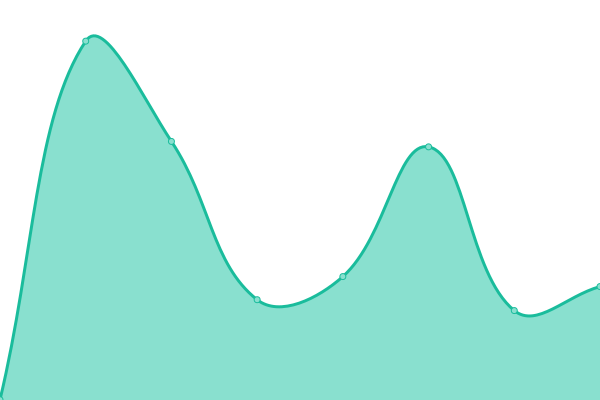
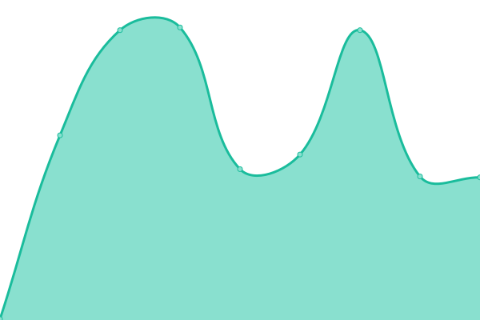
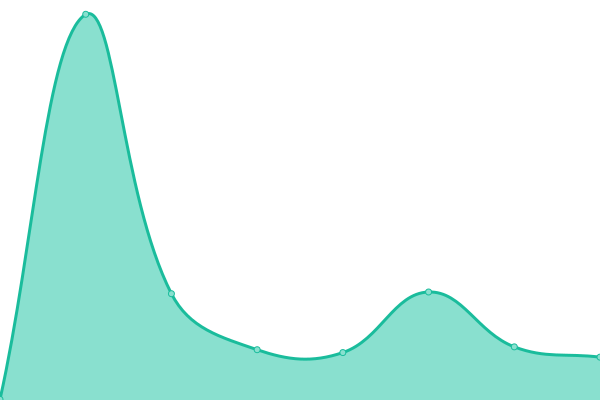
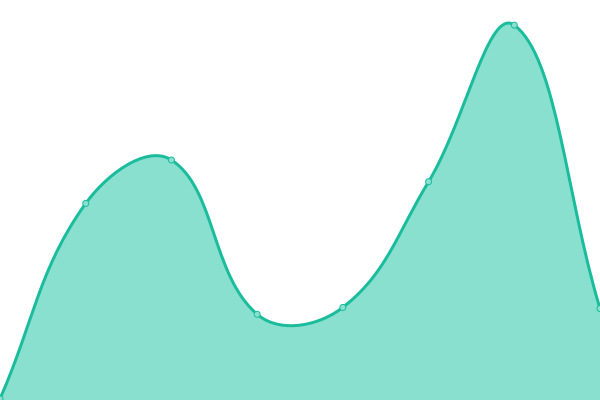
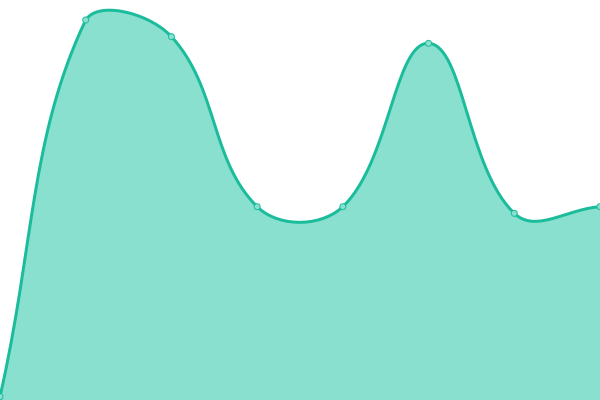

# [📈 Live Status](https://cybergis.github.io/upptime-monitoring/): <!--live status--> **🟩 All systems operational**

This repository contains the open-source uptime monitor and status page for [CyberGIS Center](http://cybergis.illinois.edu/), powered by [Upptime](https://github.com/upptime/upptime).

With [Upptime](https://upptime.js.org), you can get your own unlimited and free uptime monitor and status page, powered entirely by a GitHub repository. We use [Issues](https://github.com/cybergis/upptime-monitoring/issues) as incident reports, [Actions](https://github.com/cybergis/upptime-monitoring/actions) as uptime monitors, and [Pages](https://cybergis.github.io/upptime-monitoring/) for the status page.

<!--start: status pages-->
<!-- This summary is generated by Upptime (https://github.com/upptime/upptime) -->
<!-- Do not edit this manually, your changes will be overwritten -->
<!-- prettier-ignore -->
| URL | Status | History | Response Time | Uptime |
| --- | ------ | ------- | ------------- | ------ |
|  [CyberGIS Center](https://cybergis.illinois.edu/) | 🟩 Up | [cyber-gis-center.yml](https://github.com/cybergis/upptime-monitoring/commits/HEAD/history/cyber-gis-center.yml) | 

 668ms
     
 | 

<a href="https://cybergis.github.io/upptime-monitoring/history/cyber-gis-center">100.00%</a>
    

|  [CyberGISX Hub](https://cybergisxhub.cigi.illinois.edu/) | 🟩 Up | [cyber-gisx-hub.yml](https://github.com/cybergis/upptime-monitoring/commits/HEAD/history/cyber-gisx-hub.yml) | 

 1359ms
     
 | 

<a href="https://cybergis.github.io/upptime-monitoring/history/cyber-gisx-hub">100.00%</a>
    

|  [CyberGIS-Jupyter](https://cybergisx.cigi.illinois.edu) | 🟩 Up | [cyber-gis-jupyter.yml](https://github.com/cybergis/upptime-monitoring/commits/HEAD/history/cyber-gis-jupyter.yml) | 

 609ms
     
 | 

<a href="https://cybergis.github.io/upptime-monitoring/history/cyber-gis-jupyter">100.00%</a>
    

|  [CyberGIS-Jupyter for Water (CJW)](http://go.illinois.edu/cybergis-jupyter-water) | 🟩 Up | [cyber-gis-jupyter-for-water-cjw.yml](https://github.com/cybergis/upptime-monitoring/commits/HEAD/history/cyber-gis-jupyter-for-water-cjw.yml) | 

 749ms
     
 | 

<a href="https://cybergis.github.io/upptime-monitoring/history/cyber-gis-jupyter-for-water-cjw">100.00%</a>
    

|  [CyberGIS-Compute SDK Documentation](https://cybergis.github.io/cybergis-compute-python-sdk/) | 🟩 Up | [cyber-gis-compute-sdk-documentation.yml](https://github.com/cybergis/upptime-monitoring/commits/HEAD/history/cyber-gis-compute-sdk-documentation.yml) | 

 98ms
     
 | 

<a href="https://cybergis.github.io/upptime-monitoring/history/cyber-gis-compute-sdk-documentation">100.00%</a>
    

|  [CyberGIS-Compute Production Server](https://cgjobsup.cigi.illinois.edu/v2/) | 🟩 Up | [cyber-gis-compute-production-server.yml](https://github.com/cybergis/upptime-monitoring/commits/HEAD/history/cyber-gis-compute-production-server.yml) | 

 243ms
     
 | 

<a href="https://cybergis.github.io/upptime-monitoring/history/cyber-gis-compute-production-server">100.00%</a>
    

|  [CVMFS Stratum 0](http://cvmfs.cigi.illinois.edu/cvmfs/info/v1/repositories.json) | 🟩 Up | [cvmfs-stratum-0.yml](https://github.com/cybergis/upptime-monitoring/commits/HEAD/history/cvmfs-stratum-0.yml) | 

 133ms
     
 | 

<a href="https://cybergis.github.io/upptime-monitoring/history/cvmfs-stratum-0">100.00%</a>
    

|  [CVMFS Stratum 1 - UIUC](http://cvmfstr1.cigi.illinois.edu/cvmfs/info/v1/repositories.json) | 🟩 Up | [cvmfs-stratum-1-uiuc.yml](https://github.com/cybergis/upptime-monitoring/commits/HEAD/history/cvmfs-stratum-1-uiuc.yml) | 

 137ms
     
 | 

<a href="https://cybergis.github.io/upptime-monitoring/history/cvmfs-stratum-1-uiuc">100.00%</a>
    

|  [CVMFS Stratum 1 - Jetstream 2](http://149.165.152.146/cvmfs/info/v1/repositories.json) | 🟩 Up | [cvmfs-stratum-1-jetstream-2.yml](https://github.com/cybergis/upptime-monitoring/commits/HEAD/history/cvmfs-stratum-1-jetstream-2.yml) | 

 84ms
     
 | 

<a href="https://cybergis.github.io/upptime-monitoring/history/cvmfs-stratum-1-jetstream-2">100.00%</a>
    

<!--end: status pages-->

[**Visit our status website →**](https://cybergis.github.io/upptime-monitoring/)

## 📄 License

- Powered by: [Upptime](https://github.com/upptime/upptime)
- Code: [MIT](./LICENSE) © [Anand Chowdhary](https://anandchowdhary.com), supported by [Pabio](https://pabio.com)
- Data in the `./history` directory: [Open Database License](https://opendatacommons.org/licenses/odbl/1-0/)
